---

title: CS229

published: 2025-04-10

description: 'Machine Learning'

image: ''

tags: [notes, AI]

category: 'learn'

draft: false 

---

## Intro

1. Regression连续的Classification离散的
2. SVM无限维向量作为输入 

## linear regression, gradient decent and normal equation

batch gradient decent可能会白算，所以随机梯度下降更常用

norm equation不实用梯度下降，直接获得最优值——导数取0 

## lecture 2

### Locally weighted logistic regression

 非线性

非参数训练，参数数量会随着训练数据增加而增加 ，就是折线预测

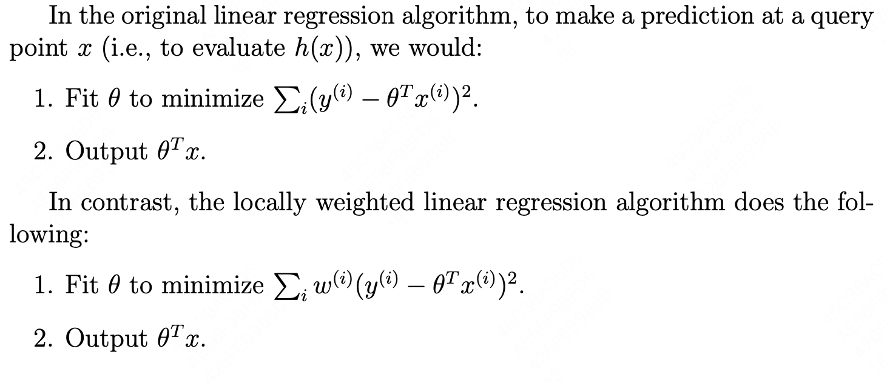

w介于01之间，用于避免过远的样本对误差的影响 e^(-距离平方/tau2  )其实就是没有归一化的高斯概率分布

权重是这个样本为中心的高斯分布 

### Why 2-NORM

来自于最大似然估计，y = theta x + epsilon，epsilon满足正态分布，于是我们可以认为P(Y|x,theta) = P(epsilon)  

给定theta形容为prob，否则形容为likelihood 

MLE最大似然估计，让真实情况的概率最大

### logistic regression 逻辑回归

 sigmoid/logistic function
$$
 \frac 1{1+e^{-z}}
$$
 对于01二分类，可以合并写为
$$
p(y|x,\theta) = h(x)^y(1-h(x))^{ 1-y}
$$
逻辑回归的最大区别是引入了sigmoid 

### Newton method 

给定f找theta满足f(theta)=0 ，可以理解为loss的导数 

用这个点的切线来拟合f获得切线与x轴交点作为新的x 

代价太大了

## lecture 3

### perception

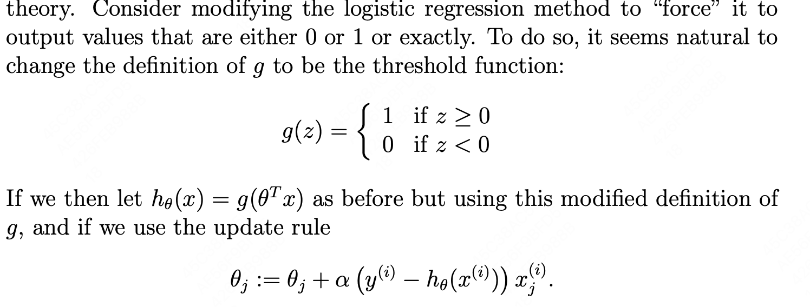

### Generalized linear models

Expotional family is 概率密度函数满足下面的形式（真实分布用高斯，二分用波努力，计数用poisson 

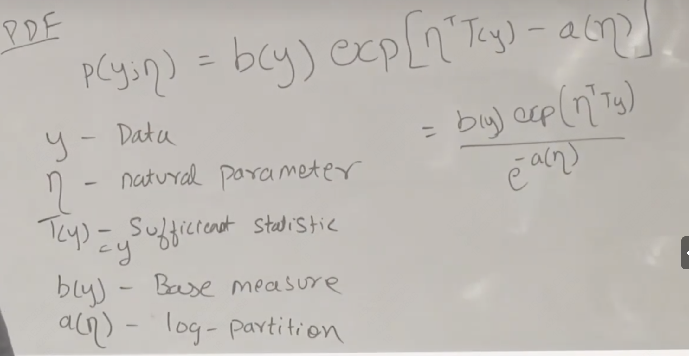

a(yita)可以理解为归一化函数

GLM性质：

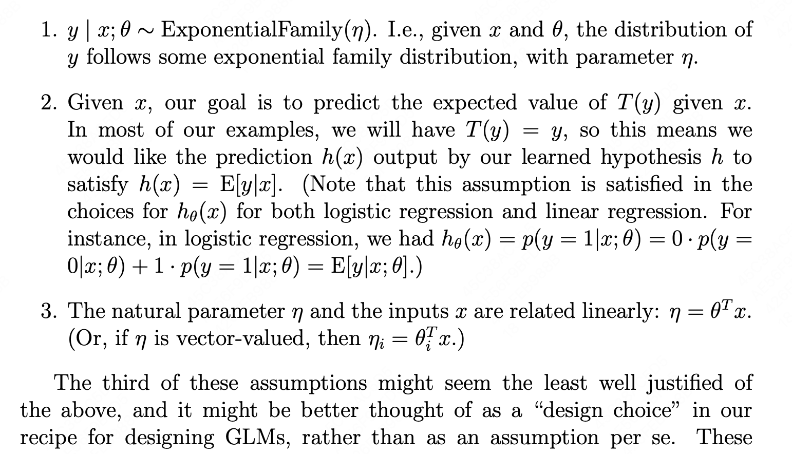

 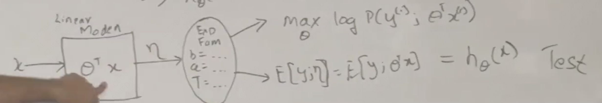

可以理解为把分布和线性模型拼起来获得我们的h hypothesis function

learning update rule

$\theta_j:=\theta_j+\alpha(y^{i}-h_\theta(x^i))x^i_j$

$\eta$是自然参数

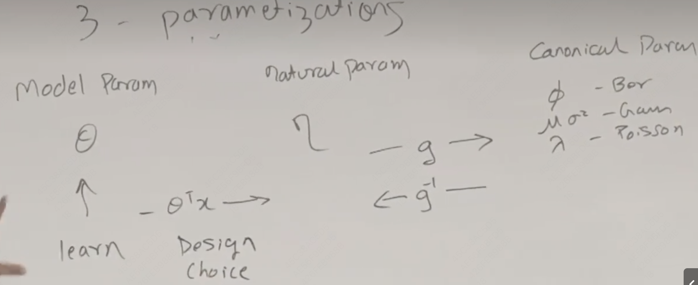

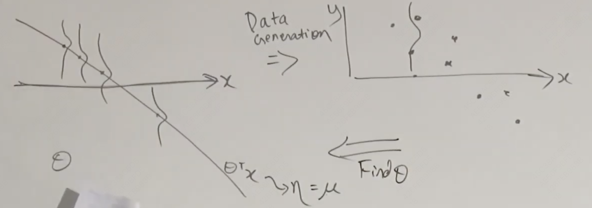

### sigmoid函数本质

对于one-hot的多分类问题，我们可以通过softmax函数正则化概率，获得一个我们预测的分布，并通过cross entropy 尽可能缩小这个预测和实际的one hot分布的差距

 ## lecture 4 Generative learning models

discriminate model注重分类，学习P(y|x)，generative model注重建模每一个类别的分布 ，学习P(x|y)（已知某种分类，是这个分类的概率，maxP(x, y )

### Gaussian Discriminal Analysis(GDA)

就是假设几个都符合高斯分布，把样本拟合成同方差（这是因为可以变成线性 ）高斯分布

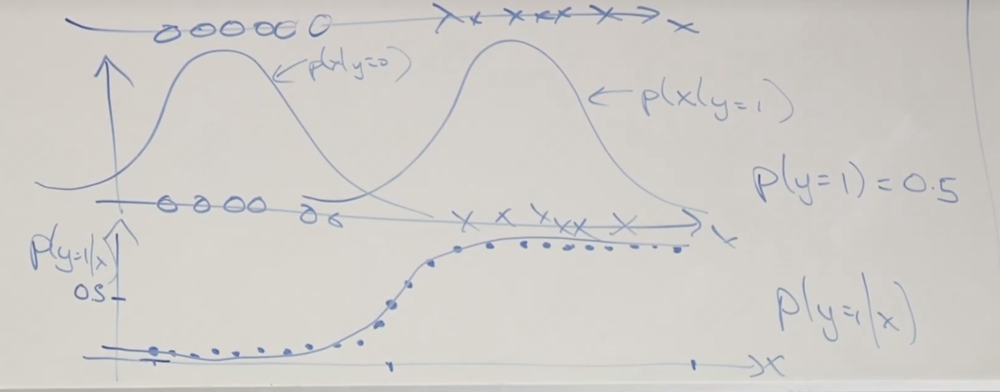

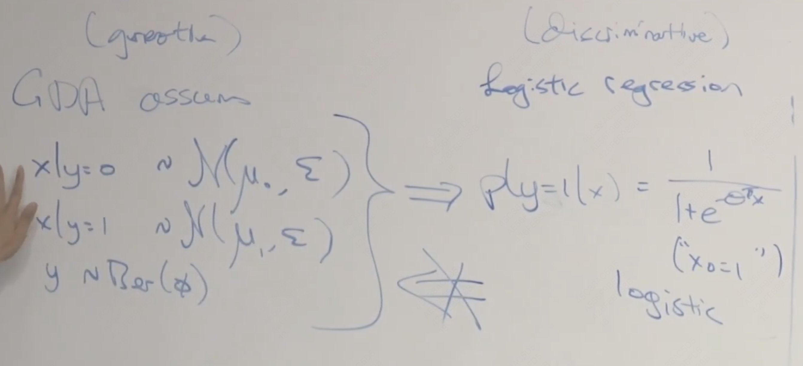

generative可以推出discrimination，这说明generative是对建模准确度要求更高，如果你知道符合什么分布，可以使用gna，但是不同的分布可能都满足discrimination

如果有更多的数据可以选择discriminate，因为你对模型依赖度低，但是你的数据更少时，建模就非常重要

gda计算更简单

如果指数分布，那么可以等效为logistic

## Naive bayes 

比如给电子邮件分类问题

可以对于hot10000的词语进行标记，如果存在就设为1

朴素的bayes假设，是否出现诈骗词与是否出现by这个词无关 

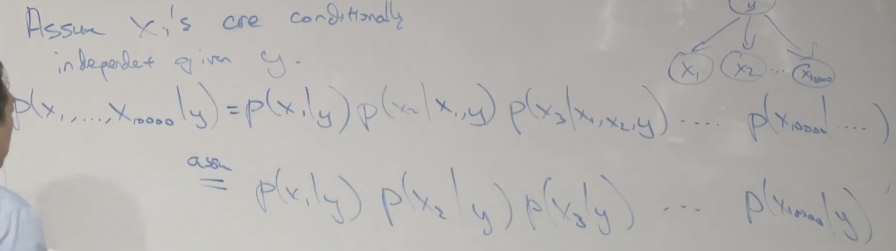

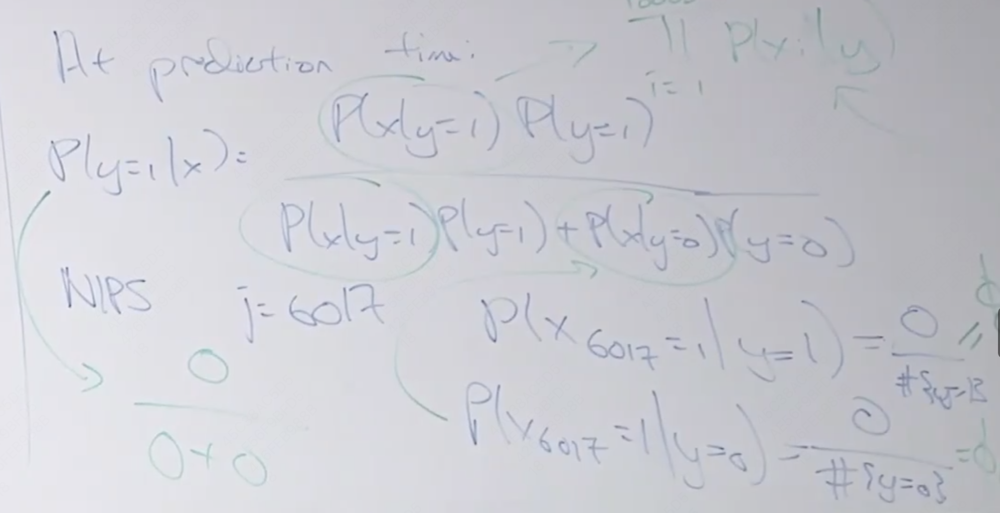

这可能会导致估计某个事件的概率为0，这在统计学上是不合适的，所以引入laplas平滑

#### 拉普拉斯平滑

给所有事件的发生次数+1

相同长度的文本向量做multivariate bernouli的问题是可能会忽略一个词出现多次，因为只记录有没有出现过

现在转而对电子邮件的每一个词进行编码，每个位置上这个词对应的编号，也就是multinomial event

native bayes还是非常朴素 

## Supported Vector Machine

通过将向量映射到更高维，提取非线性的特征

这里的g在>=0时为1，否则为-1

$g(W^TX+b)$

### function margin 分类的自信度

$$
\gamma = \frac{y_i(only\ reserve\ right )(w^Tx_i+b)}{||w||}
$$

choose the w and b for max$\gamma$
