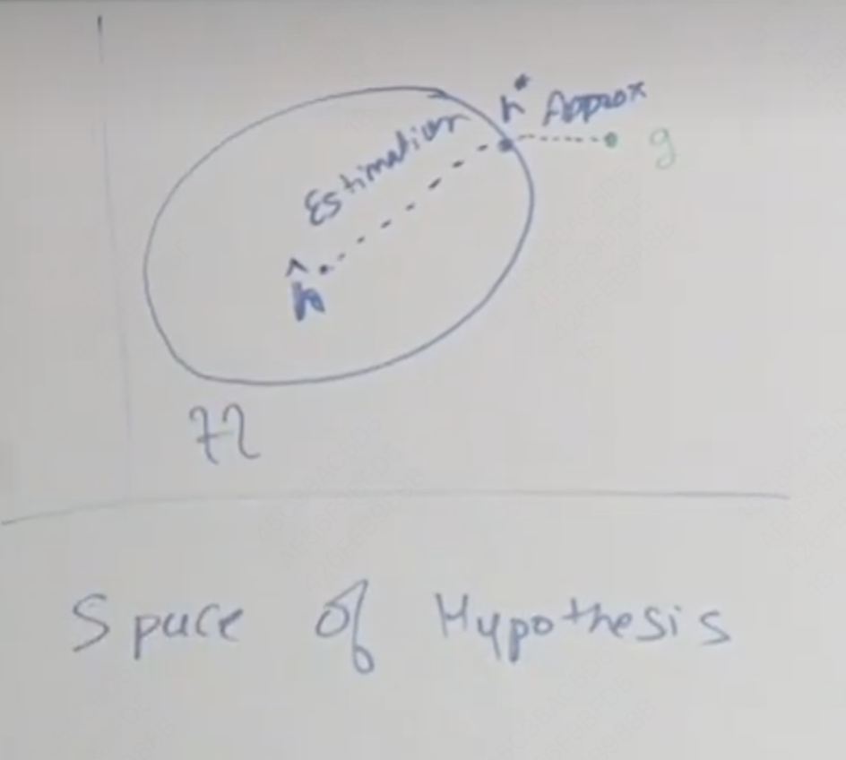
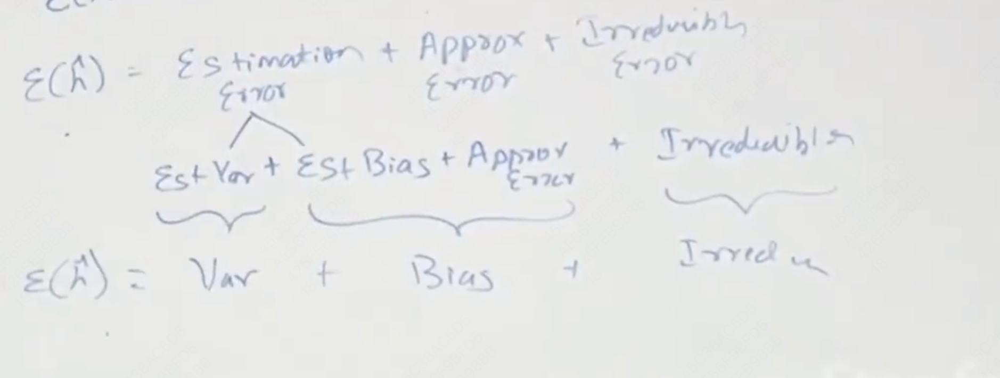
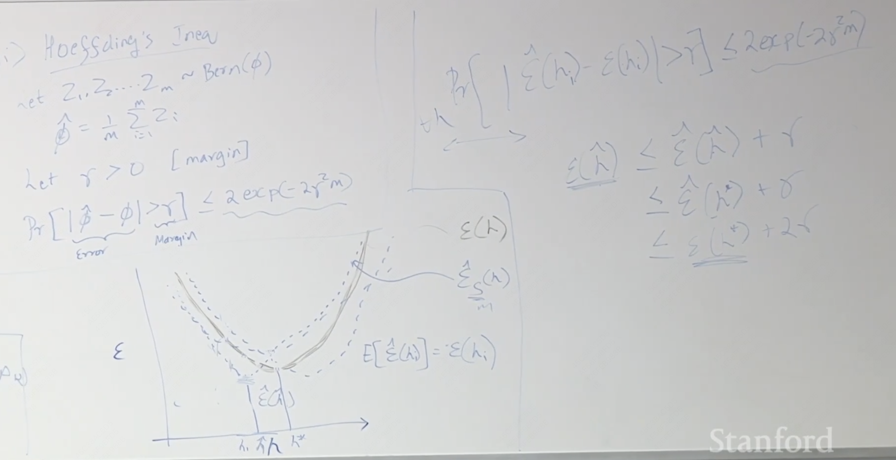

---

title: CS229

published: 2025-04-10

description: 'Machine Learning'

image: ''

tags: [notes, AI]

category: 'learn'

draft: false 

---

## Intro

1. Regression连续的Classification离散的
2. SVM无限维向量作为输入 

## linear regression, gradient decent and normal equation

batch gradient decent可能会白算，所以随机梯度下降更常用

norm equation不实用梯度下降，直接获得最优值——导数取0 

## lecture 2

### Locally weighted logistic regression

 非线性

非参数训练，参数数量会随着训练数据增加而增加 ，就是折线预测

w介于01之间，用于避免过远的样本对误差的影响 e^(-距离平方/tau2  )其实就是没有归一化的高斯概率分布

权重是这个样本为中心的高斯分布 

### Why 2-NORM

来自于最大似然估计，y = theta x + epsilon，epsilon满足正态分布，于是我们可以认为P(Y|x,theta) = P(epsilon)  

给定theta形容为prob，否则形容为likelihood 

MLE最大似然估计，让真实情况的概率最大

### logistic regression 逻辑回归

 sigmoid/logistic function
$$
 \frac 1{1+e^{-z}}
$$
 对于01二分类，可以合并写为
$$
p(y|x,\theta) = h(x)^y(1-h(x))^{ 1-y}
$$
逻辑回归的最大区别是引入了sigmoid，原本只能拟合一条直线，当新增测试点后可能会出现比较大的偏离

### Newton method 

给定f找theta满足f(theta)=0 ，可以理解为loss的导数 

用这个点的切线来拟合f获得切线与x轴交点作为新的x 

代价太大了

## lecture 3

### perception

即使数据不是完美线性可分的，Logistic回归可以通过优化损失函数（如交叉熵）来尽量让边界逼近最佳分割。由于使用了Sigmoid激活函数，让输出形成连续值，这种概率输出能够帮助更好地处理一些边界不清晰的情况。

### Generalized linear models

Expotional family is 概率密度函数满足下面的形式（真实分布用高斯，二分用伯努利，计数用poisson 

a(yita)可以理解为归一化函数

GLM性质：

 

可以理解为把分布和线性模型拼起来获得我们的h hypothesis function

learning update rule

$\theta_j:=\theta_j+\alpha(y^{i}-h_\theta(x^i))x^i_j$

$\eta$是自然参数

### sigmoid函数本质

对于one-hot的多分类问题，我们可以通过softmax函数正则化概率，获得一个我们预测的分布，并通过cross entropy 尽可能缩小这个预测和实际的one hot分布的差距

 ## lecture 4 Generative learning models

discriminate model注重分类，学习P(y|x)，generative model注重建模每一个类别的分布 ，学习P(x|y)（已知某种分类，是这个分类的概率，maxP(x, y )

### Gaussian Discriminal Analysis(GDA)

就是假设几个都符合高斯分布，把样本拟合成同方差（这是因为可以变成线性 ）高斯分布

generative可以推出discrimination，这说明generative是对建模准确度要求更高，如果你知道符合什么分布，可以使用gna，但是不同的分布可能都满足discrimination

如果有更多的数据可以选择discriminate，因为你对模型依赖度低，但是你的数据更少时，建模就非常重要

gda计算更简单

如果指数分布，那么可以等效为logistic

## Naive bayes 

比如给电子邮件分类问题

可以对于hot10000的词语进行标记，如果存在就设为1

朴素的bayes假设，是否出现诈骗词与是否出现by这个词无关 

这可能会导致估计某个事件的概率为0，这在统计学上是不合适的，所以引入laplas平滑

#### 拉普拉斯平滑

给所有事件的发生次数+1

相同长度的文本向量做multivariate bernouli的问题是可能会忽略一个词出现多次，因为只记录有没有出现过

现在转而对电子邮件的每一个词进行编码，每个位置上这个词对应的编号，也就是multinomial event

native bayes还是非常朴素 

## Supported Vector Machine

通过将向量映射到更高维，提取非线性的特征

这里的g在>=0时为1，否则为-1

$g(W^TX+b)$

### function margin 分类的自信度

$$
\gamma = \frac{y_i(only\ reserve\ right )(w^Tx_i+b)}{||w||}
$$

choose the w and b for max$\gamma$

also can be written as 
$$
max\ \gamma \\
s.t. \frac{y_i(w^Tx_i+b)}{||w||} \ge \gamma
$$
 let $\gamma = 1/\omega$, then the problem is 
$$
min\ \frac{1}{2}\omega^2 \\
s.t. y_i(w^Tx_i+b) \ge 1
$$
Suppose 
$$
\omega = \sum_{i = 1}^m \alpha_i y_ix_i
$$
即w是x的线性组合，这可以理解为w垂直于边界，同时边界在x的空间内
$$
min\ \frac{1}{2}\sum_{i = 1}^m\sum_{j = 1}^m \alpha_i\alpha_jy_iy_jx_i^Tx_j(<x_i, x_j>) \\
s.t. y_i(\sum_{i = 1}^m\alpha_jy_j<x_j, x_i>+b) \ge 1
$$
$x\rarr \phi(x)$映射到高维

我们希望找到一个办法，计算$K(x, z) = \phi^T(x)\phi(z )$ 

如果$K(x, z) = (x^Tz+t)^d$, 那么$\phi(x)$包含所有小于d维的多项式 

optimal margin classifier + kenel = SVM SVM中kenel的作用是映射到高维来找线性分类，同时通过直接定义K来简化计算

**如何选择kenel**

不相似向量的内积很小

核矩阵是合适的核矩阵的充要条件是核矩阵半正定

一个常用的核矩阵：$exp(-\frac{(||x-z||)^2}{2\sigma^2 }$

核函数适用于所有讲过的discriminate algorithm

### L1norm soft margin sum

如果不希望完全的线性分类，避免过拟合

$\epsilon_i$可以不完全分类，同时又不希望他过大  
$$
min\ \frac{1}{2}\omega^2 + c\sum\epsilon_i\\
s.t. y_i(w^Tx_i+b) \ge 1 - \epsilon_i\\epsilon_i >0
\
$$

## lecture9

### assumption

(x,y)满足某种分布

独立采样

### 可能出现的情况

算法预测得到的参数有较大的方差/bias，通过提高数据量可能可以让bias变为0，即算法得到的参数的期望与真实参数相同

降低方差：正则化，可能会提高bias/提高数据量

假设你有一个H类，$h^*$是这个类中的最优，g是全局最优，$\hat h$是有限数据训练出来的，

$\epsilon(h) = E_{(x,y) in D}[1{h(x) != y}]$是risk（泛化误差

$\epsilon_s(h) = \frac{1}{m}\sum_{i=1}^m1[{h(x)!=y}]$empirical risk,经验错误，与上面的不同的是有限计算，上面是无限持续计算

$\epsilon(g)$不可避免的贝叶斯error

$\epsilon(h^*)-\epsilon(g)$ approximation error，选择这个类的误差

$\epsilon(\hat h)-\epsilon(h^*)$ estimation error

所以$\epsilon(\hat h)$为上面三个之和

正则化减少了假设的类别，降低了H的范围所以可以降低方差，但是可能会增加bias

### Empirical Risk Minimizer

 $\hat h _{ERM} = argmin_{h \in H}\epsilon_s(h)$

#### Uniform convergence一致收敛

经验误差会收敛到泛化误差

#### finite

 
