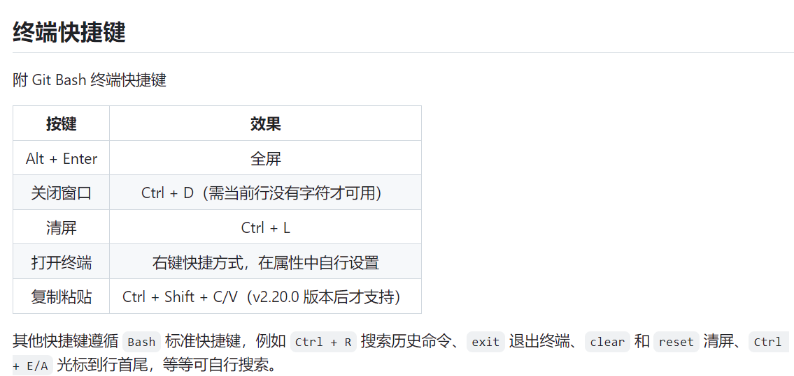
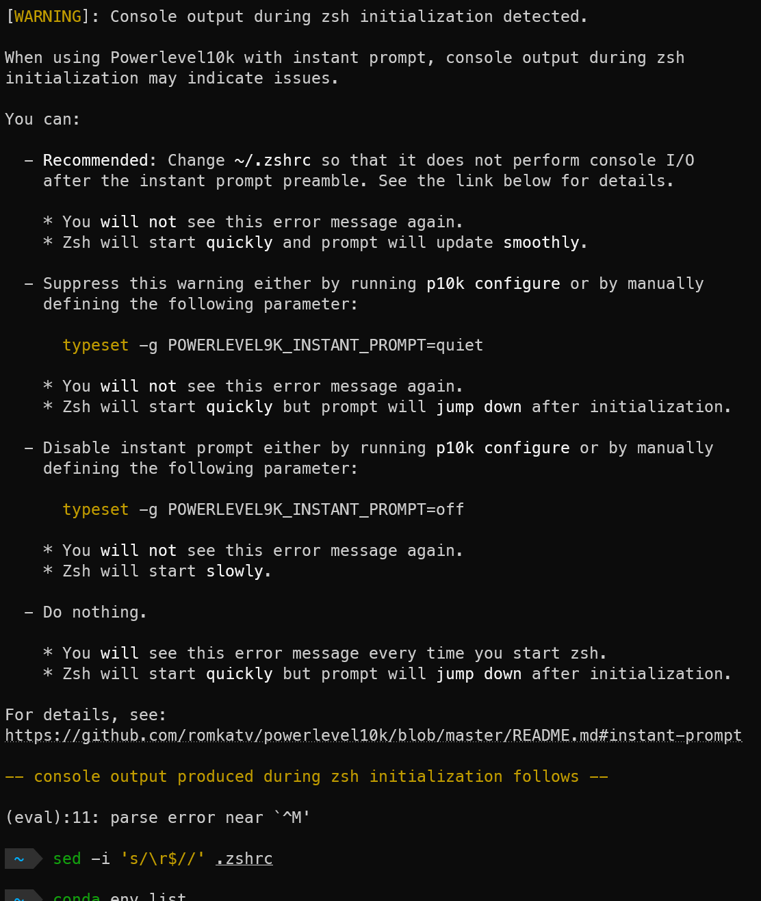
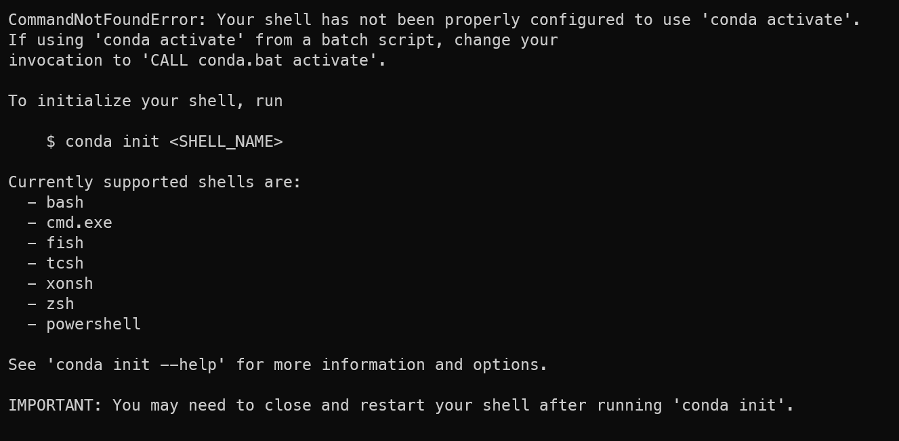
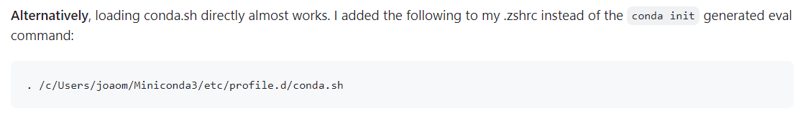
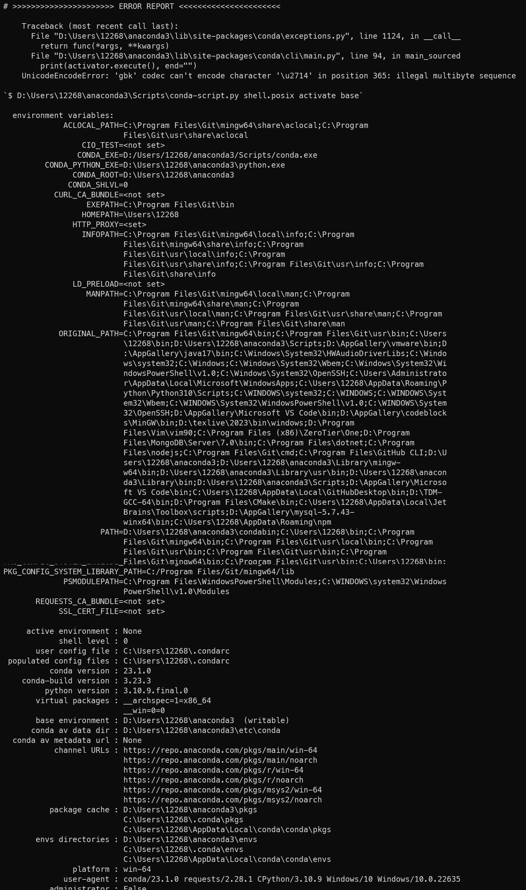
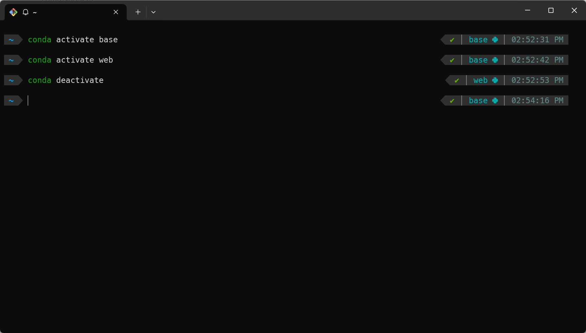

---

title: windows zsh配置
published: 2024-10-24

description: 'rt'

image: ''

tags: [tutorial]

category: 'tools'

draft: false 

---

参考教程：

use ***zsh*** on windows

[https://miaotony.xyz/2020/12/13/Server_Terminal_gitbash_zsh/#toc-heading-5](https://miaotony.xyz/2020/12/13/Server_Terminal_gitbash_zsh/#toc-heading-5)

[https://dev.to/equiman/zsh-on-windows-without-wsl-4ah9](https://dev.to/equiman/zsh-on-windows-without-wsl-4ah9)

- I changed some in .zshrc to deal with bug
  
    
    
    ```bash
    plugins=(git wd)
    
    plugins=(zsh-autosuggestions)
    plugins=(zsh-syntax-highlighting)
    
    source $ZSH/oh-my-zsh.
    
    ```
    

到这一步已经可以正常使用linux命令了

## 但我在使用conda的过程中遇到了报错

- 报错截图
  
    
    
    

可以看到这是两个报错，一个是conda activate失败，另外一个是zsh启动主题的过程中遇到了Windows换行符（这是真烦人啊）

google到两个错误均由conda init命令引起，尝试解决方法：

[https://www.cnblogs.com/kphang/p/17264764.html](https://www.cnblogs.com/kphang/p/17264764.html)

- 尝试（不需要做）
  
    [https://github.com/conda/conda/issues/9922#:~:text=Alternatively%2C loading conda.sh directly almost works. I added the following to my .zshrc instead of the conda init generated eval command%3A](https://github.com/conda/conda/issues/9922#:~:text=Alternatively%2C%20loading%20conda.sh%20directly%20almost%20works.%20I%20added%20the%20following%20to%20my%20.zshrc%20instead%20of%20the%20conda%20init%20generated%20eval%20command%3A)
    
    
    
    - 此时启动终端不会再报错，但是出现报错
      
        
        
    - 咨询gpt后解决
      
        您可以尝试设置 **`PYTHONIOENCODING`** 环境变量为 **`utf-8`**。这告诉 Python 使用 UTF-8 编码进行输入输出操作。
        
        1. 右键点击“此电脑”或“我的电脑”，选择“属性”。
        2. 选择“高级系统设置”。
        3. 在“系统属性”窗口中，选择“环境变量”。
        4. 在“系统变量”区域，点击“新建”。
        5. 设置变量名为 **`PYTHONIOENCODING`**，变量值为 **`utf-8`**。
        6. 点击“确定”保存并退出所有设置。
        7. 重启您的计算机或重新打开命令行窗口，然后再次尝试运行 **`conda`** 命令。

### 最终解决方案：

[https://github.com/conda/conda/issues/9922#issuecomment-1361695031](https://github.com/conda/conda/issues/9922#issuecomment-1361695031)

将conda init添加的内容改为

`eval "$('/c/path/to/miniconda3/Scripts/conda.exe' 'shell.zsh' 'hook' | sed -e 's/"$CONDA_EXE" $_CE_M $_CE_CONDA "$@"/"$CONDA_EXE" $_CE_M $_CE_CONDA "$@" | tr -d \x27\\r\x27/g')"`

路径改为你的conda.exe路径，完美解决！

