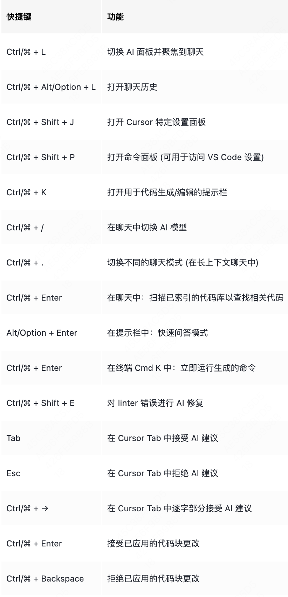

1. command+L 打开对话

2. command+K直接用代码对话

3. 为 Cursor 添加自定义指令，这些指令将应用于 Cursor Chat 和 Ctrl/⌘ K 等功能。
   
   - 全局规则：在 Cursor 设置 > 通用 > AI 规则 中修改
     4- 利用 `/edit` 命令快速描述并实现对当前文件的更改。
   
    

[VSCode 快捷键大全 | 菜鸟教程](https://www.runoob.com/vscode/vscode-shortcut-keys.html)

## vscode

option+z 自动换行

| 功能             | Windows/Linux                        | macOS                   |
| -------------- | ------------------------------------ | ----------------------- |
| 打开命令面板         | `Ctrl + Shift + P`                   | `Cmd + Shift + P`       |
| 打开设置           | `Ctrl + ,`                           | `Cmd + ,`               |
| **打开终端**       | `` Ctrl + ` ``                       | `` Ctrl + ` ``          |
| 新建窗口           | `Ctrl + Shift + N`                   | `Cmd + Shift + N`       |
| 关闭窗口           | `Ctrl + Shift + W`                   | `Cmd + Shift + W`       |
| 保存文件           | `Ctrl + S`                           | `Cmd + S`               |
| 全部保存           | `Ctrl + K S`                         | `Cmd + Option + S`      |
| 自动保存切换         | `Ctrl + Shift + P` 后搜索 **Auto Save** | 同左                      |
| 快速打开，转到文件      | `Ctrl + P`                           | `Cmd + P`               |
| 键盘快捷键设置        | `Ctrl + K, Ctrl + S`                 | `Cmd + K, Cmd + S`      |
| 另存为            | `Ctrl + Shift + S`                   | `Cmd + Shift + S`       |
| 关闭文件           | `Ctrl + W`                           | `Cmd + W`               |
| 关闭所有文件         | `Ctrl + K, Ctrl + W`                 | `Cmd + K, Cmd + W`      |
| 重新打开关闭的文件      | `Ctrl + Shift + T`                   | `Cmd + Shift + T`       |
| 打开文件夹          | `Ctrl+K O`                           | `Cmd+K O`               |
| 上一个文件          | `Ctrl+Tab`                           | `Cmd+Tab`               |
| 下一个文件          | `Ctrl+Shift+Tab`                     | `Cmd+Shift+Tab`         |
| 切换编辑器布局        | `Alt+Shift+数字`                       | `Cmd+Option+数字`         |
| 格式化代码          | `Shift + Alt + F`                    | `Shift + Option + F`    |
| 复制当前行          | `Alt + Shift + Down`                 | `Option + Shift + Down` |
| 删除当前行          | `Ctrl + Shift + K`                   | `Cmd + Shift + K`       |
| 移动当前行          | `Alt + Up/Down`                      | `Option + Up/Down`      |
| 选中当前行          | `Ctrl + L`                           | `Cmd + L`               |
| 放大/缩小          | `Ctrl + = / -`                       | `Cmd + = / -`           |
| 打开 Markdown 预览 | `Ctrl + K, V`                        | `Cmd + K, V`            |
| 禅模式            | `Ctrl + K, Z`                        | `Cmd + K, Z`            |